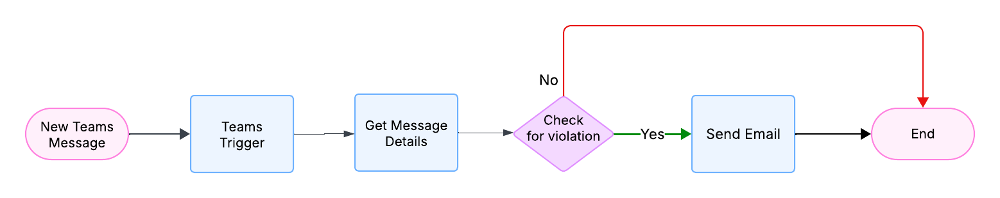
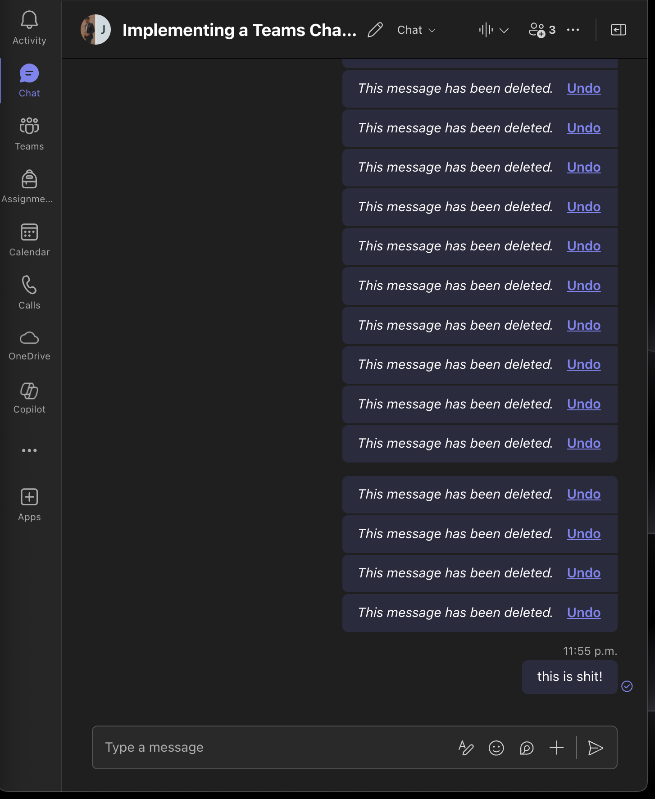

<!-- 

Repo:
https://github.com/degu0055/Lab-3-Implementing-a-Teams-Chat-Content-Moderation-Service 

CHATGPT:
https://chatgpt.com/c/687829a9-0fc8-8001-b0e1-ee09db67923a

-->

# CST8917 Lab 3: Teams Chat Content Moderation using Azure Logic Apps

## 🧾 Summary

This project implements a **Microsoft Teams chat content moderation service** using **Azure Logic Apps**. The workflow monitors Teams messages in real time, detects inappropriate content (e.g., profanity), and automatically sends an email notification to an administrator when violations are found.

Technologies used:
- **Azure Logic Apps** (main orchestration)
- **Microsoft Teams** connector
- **Office 365 Outlook** connector (email alerting)

---

## ⚙️ Logic App Setup

### 🧩 Trigger
- **When a new message is added to a chat or channel** (Microsoft Teams)
- **Group Chat** selected as the message source.

> **Note**: This trigger does not provide message content directly. To fix this, we added an extra step (`Get message details`).

### 🔧 Actions
1. **Get message details**
   - Retrieves full message content from Teams API using the message ID from the trigger.
2. **Condition** – Check for violation
   - Evaluates if `body.body.content` contains banned words (e.g., "sh*t").
3. **If true** (violation detected):
   - Sends an email using the **Outlook connector**.
   - Email includes:
     - Message content
     - Sender’s name
     - Timestamp
4. **If false**:
   - Ends workflow without sending email.

---

## 🧠 Flowchart

The flowchart outlining the moderation workflow is included below:

---

## 🧪 Testing

### ✅ Test Case: No Violation
- Sent a message like “Hello, good morning” in Teams.
- Logic App ran, fetched message details.
- Condition was false → **No email sent**.

### 🚫 Test Case: Violation Detected
- Sent a message like “this is sh*t!” in Teams.
- Logic App detected violation.
- Email received within seconds:
  - Subject: "Inappropriate Message Detected"
  - Body included the message content, sender name, and timestamp.

### Screenshots:

---

## 🧱 Challenges & Fixes

### ❗ Challenge
The **“When a new message is added to a chat or channel”** trigger does not expose the actual chat content. Using `body.content` in a condition always fails.

### ✅ Solution
Added a **“Get message details”** step immediately after the trigger. This retrieves the full message using the `message ID`, enabling proper content evaluation in the condition block.

---

## 🎥 Demo Video

[Click here to watch the demo video](https://drive.google.com/file/d/1i6ZysIWS9F1vXk0FH3tlo73U9D7uCDCC/view?usp=sharing)

